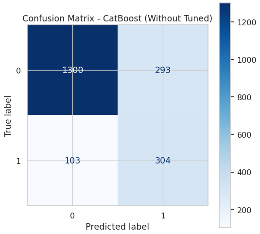
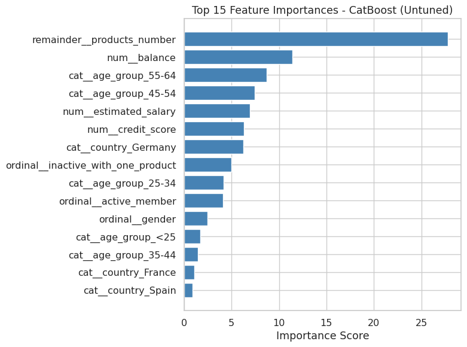
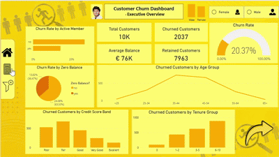
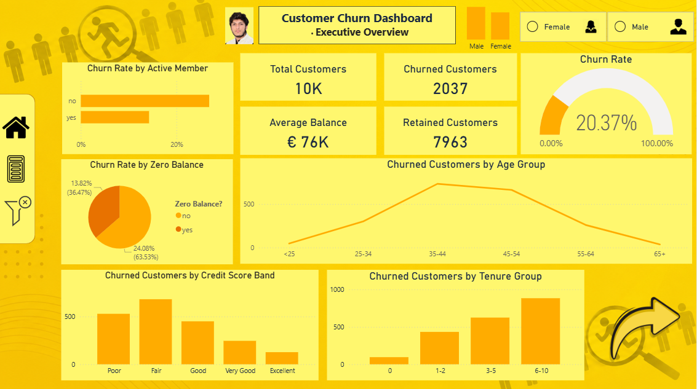
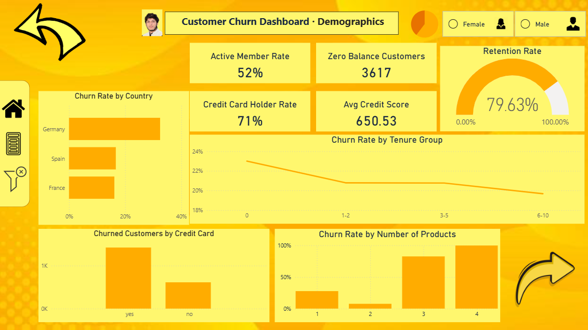
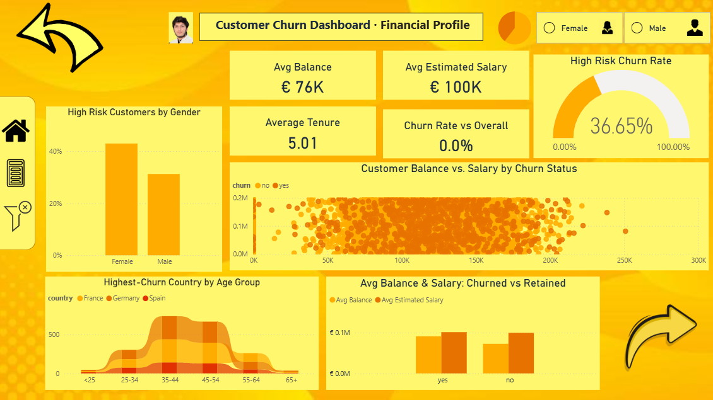

# 🏦 Customer Churn Prediction & Analytics Dashboard

_Predicting which bank customers are likely to churn — and prescribing what to do about it — using Python, CatBoost, PyTorch, FastAPI, and Power BI._

---

## 📌 Table of Contents
- <a href="#overview">Overview</a>
- <a href="#business-problem">Business Problem</a>
- <a href="#dataset">Dataset</a>
- <a href="#tools--technologies">Tools & Technologies</a>
- <a href="#skills-demonstrated">Skills Demonstrated</a>
- <a href="#project-structure">Project Structure</a>
- <a href="#project-workflow">Project Workflow</a>
- <a href="#exploratory-data-analysis">Exploratory Data Analysis (EDA)</a>
- <a href="#feature-engineering">Feature Engineering</a>
- <a href="#model-training--comparison">Model Training & Comparison</a>
- <a href="#deep-learning-model">Deep Learning Model</a>
- <a href="#hyperparameter--threshold-tuning">Hyperparameter & Threshold Tuning</a>
- <a href="#model-selection-rationale">Model Selection Rationale</a>
- <a href="#final-model-performance">Final Model Performance</a>
- <a href="#feature-importance">Feature Importance</a>
- <a href="#predictive-analytics">Predictive Analytics</a>
- <a href="#prescriptive-analytics">Prescriptive Analytics</a>
- <a href="#dashboard">Dashboard</a>
- <a href="#live-demo--deployment">Live Demo & Deployment</a>
- <a href="#how-to-run-this-project">How to Run This Project</a>
- <a href="#future-work">Future Work</a>
- <a href="#author--contact">Author & Contact</a>

---
<h2><a class="anchor" id="overview"></a>Overview</h2>

This project builds a complete, end-to-end machine learning pipeline to predict customer churn for a retail banking dataset. The goal is to identify customers at risk of leaving so retention efforts can be targeted proactively, rather than reactively.

The workflow covers the full modeling lifecycle: exploratory data analysis, feature engineering, preprocessing pipeline design, comparison across multiple model families (classical ML, gradient boosting, and deep learning), hyperparameter and threshold tuning, feature importance analysis, and final model selection based on business-relevant evaluation metrics — followed by live deployment as a REST API.

---
<h2><a class="anchor" id="business-problem"></a>Business Problem</h2>

In churn prediction, correctly identifying customers who are likely to leave (**recall**) is prioritized over minimizing false positives (**precision**), since the cost of missing an at-risk customer — a lost customer with no chance for intervention — outweighs the cost of an unnecessary retention outreach to a customer who was never going to leave.

This project aims to:
- Identify which customers are at the highest risk of churning
- Understand *why* customers churn, using feature importance analysis
- Translate those findings into concrete, actionable retention strategies
- Deploy the trained model as a live, usable prediction service

---
<h2><a class="anchor" id="dataset"></a>Dataset</h2>

- Raw customer data: `data/raw/customer_data.csv`
- Cleaned, feature-engineered dataset: `data/processed/customer_churn_processed.csv`
- 10,000 customer records, containing demographic information (age, gender, geography), account details (credit score, balance, tenure, number of products), and engagement indicators (active membership status, credit card ownership), with `churn` as the target variable.

---
<h2><a class="anchor" id="tools--technologies"></a>Tools & Technologies</h2>

- **Language:** Python
- **Data Handling:** Pandas, NumPy
- **Machine Learning:** Scikit-learn, CatBoost, XGBoost, LightGBM
- **Deep Learning:** PyTorch
- **Visualization:** Matplotlib, Seaborn, Power BI
- **API & Deployment:** FastAPI, Joblib, Railway
- **Testing:** Requests (Python library, used to test the live deployed API)
- **Version Control:** Git & GitHub

---
<h2><a class="anchor" id="skills-demonstrated"></a>Skills Demonstrated</h2>

- Data Inspection & Cleaning
- Exploratory Data Analysis (EDA)
- Feature Engineering
- Data Preprocessing (Encoding & Scaling) via Scikit-learn Pipelines
- Model Training & Comparison Across Multiple Algorithms
- Deep Learning Model Design (Custom PyTorch Neural Network)
- Hyperparameter Tuning (GridSearchCV)
- Decision Threshold Tuning
- Model Evaluation & Model Selection
- Feature Importance Analysis
- Predictive Analytics
- Prescriptive Analytics
- Model Deployment (REST API with FastAPI)
- Live API Testing
- Dashboard Design (Power BI)

---
<h2><a class="anchor" id="project-structure"></a>Project Structure</h2>

```
customer-churn-analytics-ml/
│
├── README.md
├── requirements.txt
│
├── data/
│   ├── raw/
│   │   └── customer_data.csv
│   └── processed/
│       └── customer_churn_processed.csv
│
├── notebook/
│   └── churn_analytics_endtoend.ipynb
│
├── model/
│   ├── best_churn_pipeline.joblib
│   ├── confusion_matrix.png
│   └── feature_importance.png
│
├── dashboard/
│   ├── dashboard_demo.gif
│   ├── page1_overview.png
│   ├── page2_demographics.png
│   └── page3_financial.png
│
└── deployment/
    ├── main.py
    └── requirements.txt
```

---
<h2><a class="anchor" id="project-workflow"></a>Project Workflow</h2>

1. Imports
2. Load the Data
3. Initial Inspection
4. Exploratory Data Analysis (Visualizations)
5. Feature Engineering
6. Preprocessing — Encoding & Scaling
7. Train/Test Split
8. Train Multiple Models with a Pipeline and Compare via Cross-Validation
9. Deep Learning Model: Custom PyTorch Neural Network
10. Hyperparameter & Threshold Tuning — CatBoost
11. Fit Best Model on Full Train Set and Evaluate on Test Set
12. Feature Importance
13. Save Best Pipeline and Preprocessing Artifacts
14. Example: Predict Churn for a New Customer
15. Model Deployment Testing

---
<h2><a class="anchor" id="exploratory-data-analysis"></a>Exploratory Data Analysis (EDA)</h2>

Extensive EDA was performed to understand churn drivers before modeling, including:
- Churn rate by number of products, age group, geography, and account activity
- Distribution analysis of balance, credit score, and estimated salary
- Correlation analysis between numeric features and churn

Key early findings that shaped feature engineering decisions:
- Customers with 3+ products showed dramatically higher churn (83%–100%) compared to customers with 1–2 products (~8%–28%)
- Inactive members churned at nearly 2x the rate of active members
- Churn risk was non-linear across age, peaking in the 45–64 age range

---
<h2><a class="anchor" id="feature-engineering"></a>Feature Engineering</h2>

Engineered features to surface non-linear relationships the raw columns alone don't capture, including:
- **`has_zero_balance`** — flags customers with a $0 account balance
- **`inactive_with_one_product`** — a compound risk feature identifying inactive members holding only one product
- **`age_group`** and **`tenure_group`** — readable, binned categories capturing non-linear churn patterns across age and tenure

Each candidate feature was validated by comparing churn rate across its categories before inclusion — features showing meaningful separation (e.g. number of products) were retained, while features with negligible variation (e.g. credit score band) were excluded from modeling to avoid adding noise.

---
<h2><a class="anchor" id="model-training--comparison"></a>Model Training & Comparison</h2>

Multiple models were trained inside Scikit-learn pipelines (preprocessing + classifier bundled together) and compared using 5-fold stratified cross-validation across accuracy, precision, recall, F1-score, and ROC AUC:

- Logistic Regression
- Random Forest
- HistGradientBoosting
- XGBoost
- LightGBM
- CatBoost
- Multi-Layer Perceptron (MLP)

---
<h2><a class="anchor" id="deep-learning-model"></a>Deep Learning Model: Custom PyTorch Neural Network</h2>

To explore whether a deep learning approach could capture patterns beyond traditional ML, a custom feedforward neural network was designed and trained from scratch in PyTorch — including a hand-built architecture (BatchNorm, Dropout-regularized fully connected layers), a custom Focal Loss function tailored to the dataset's class imbalance, a learning-rate scheduler, and early stopping based on a dedicated validation set. The model was evaluated against traditional ML baselines using a consistent train/validation/test split and decision-threshold tuning.

---
<h2><a class="anchor" id="hyperparameter--threshold-tuning"></a>Hyperparameter & Threshold Tuning</h2>

Grid search was performed over CatBoost's core parameters (iterations, learning rate, and depth) using 5-fold stratified cross-validation, optimizing for F1-score on the churn class. Results confirmed the manually configured parameters were already near-optimal, with the tuned variant differing by less than 1% F1 — within normal cross-validation variance.

The decision threshold was subsequently tuned on a held-out validation set to balance precision and recall for the churn class, rather than relying on the default 0.5 cutoff.

---
<h2><a class="anchor" id="model-selection-rationale"></a>Model Selection Rationale</h2>

While the deep learning model provided a strong architectural exploration, the classical machine learning model (CatBoost) demonstrated superior recall on the churn class — consistently identifying a higher proportion of actual churners. In a customer churn context, correctly identifying customers who are likely to churn is of greater business priority than optimizing overall retention accuracy, as failing to flag an at-risk customer represents a missed intervention opportunity.

Additionally, the untuned CatBoost configuration achieved higher recall on the test set than the grid-search-tuned version (0.75 vs 0.71). Since recall is the priority metric for this project, the untuned configuration was retained as the final production model.

---
<h2><a class="anchor" id="final-model-performance"></a>Final Model Performance</h2>

**Final Model:** CatBoost (untuned configuration)

| Metric | Score |
|---|---|
| Accuracy | 0.80 |
| Precision (Churn) | 0.51 |
| Recall (Churn) | 0.75 |
| F1-Score (Churn) | 0.61 |
| ROC AUC | 0.8646 |



---
<h2><a class="anchor" id="feature-importance"></a>Feature Importance</h2>



The CatBoost model's feature importance ranking closely matched patterns discovered during manual EDA, reinforcing confidence in the results:

1. **`products_number`** — by a wide margin, the strongest predictor of churn
2. **`balance`**
3. **`age_group` (55–64)**
4. **`age_group` (45–54)**
5. **`estimated_salary`**
6. **`credit_score`**
7. **`country` (Germany)**
8. **`inactive_with_one_product`**
9. **`age_group` (25–34)**
10. **`active_member`**

---
<h2><a class="anchor" id="predictive-analytics"></a>Predictive Analytics</h2>

The core of this project is predictive: given a customer's account and engagement data, the CatBoost model estimates the probability that customer will churn. This allows the bank to move from reactive customer service to proactive retention — flagging at-risk customers before they leave, rather than after.

---
<h2><a class="anchor" id="prescriptive-analytics"></a>Prescriptive Analytics</h2>

Prescriptive analytics goes a step beyond prediction — it recommends specific, optimal courses of action based on what the model has learned. Using the feature importance findings above, the following actions are recommended:

- **Customers holding 3+ products** are the single highest-risk segment (83%–100% historical churn rate). Recommend a proactive account review or simplification outreach whenever a customer adds a 3rd product, rather than waiting for churn signals to appear later.
- **Inactive members holding only one product** form a distinct, elevated-risk segment. Recommend targeted re-engagement campaigns (app nudges, personalized offers) for this specific group.
- **Customers aged 45–64** show consistently higher churn than other age groups. Recommend loyalty incentives and retention-focused messaging tailored to this age band.
- **Customers in Germany** show a disproportionately higher churn signal relative to France and Spain. Recommend a localized retention strategy review specific to this market.
- **Low account balance combined with low engagement** should be treated as an early-warning combination, prioritized for retention outreach ahead of higher-balance, actively engaged customers.

---
<h2><a class="anchor" id="dashboard"></a>Dashboard</h2>

An interactive Power BI dashboard was built to visualize churn patterns across demographics, financial segments, and account behavior.



| Overview | Demographics | Financial |
|---|---|---|
|  |  |  |

---
<h2><a class="anchor" id="live-demo--deployment"></a>Live Demo & Deployment</h2>

The trained CatBoost model was deployed as a live REST API using **FastAPI**, hosted on **Railway**. The API exposes a `/predict` endpoint that accepts raw customer features as JSON and returns a churn prediction with probability scores.

**Live API URL:** [https://customer-churn-analytics-ml-production.up.railway.app](https://customer-churn-analytics-ml-production.up.railway.app)

**Live Web App Demo:** [customer-churn-guard.lovable.app](https://customer-churn-guard.lovable.app)

> ⚠️ **Note:** The live demo may take up to a minute to respond on the first request. This is expected — Railway's free tier puts the service to sleep after a period of inactivity, and it takes a moment to wake back up on the next request.

A request was sent directly to the deployed endpoint from within the project notebook (Step 15) to confirm the model is live, reachable, and returning correct predictions — validating the full pipeline end-to-end: request → preprocessing → model inference → JSON response.

---
<h2><a class="anchor" id="how-to-run-this-project"></a>How to Run This Project</h2>

1. Clone the repository:
```bash
git clone https://github.com/TufanAnalyst/customer-churn-analytics-ml.git
```
2. Install dependencies:
```bash
pip install -r requirements.txt
```
3. Open and run the notebook:
   - `notebook/churn_analytics_endtoend.ipynb`
4. Open the Power BI dashboard:
   - `dashboard/` (Power BI file)

---
<h2><a class="anchor" id="future-work"></a>Future Work</h2>

- Continue strengthening machine learning fundamentals, with a deeper focus on deep learning architectures for tabular data
- Expand feature set with additional behavioral data (transaction history, support ticket sentiment, login frequency trends) if made available
- Build out the full-stack web application (Lovable frontend + FastAPI backend) into a polished, publicly shareable product
- Explore model monitoring and retraining strategies for production use

---
<h2><a class="anchor" id="author--contact"></a>Author & Contact</h2>

**Ahmad Munir**
📧 Email: ahmad.munir.data@gmail.com
🔗 [GitHub](https://github.com/TufanAnalyst)
🔗 [LinkedIn](https://www.linkedin.com/in/ahmad-munir-437430376)
